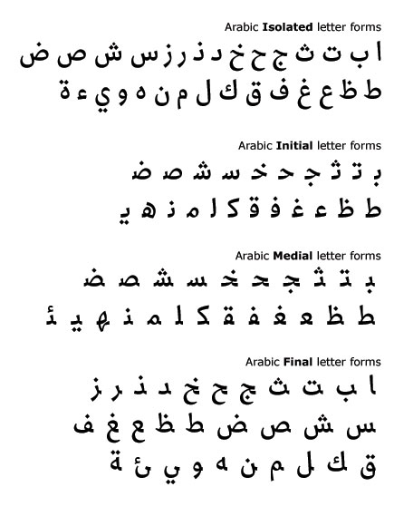
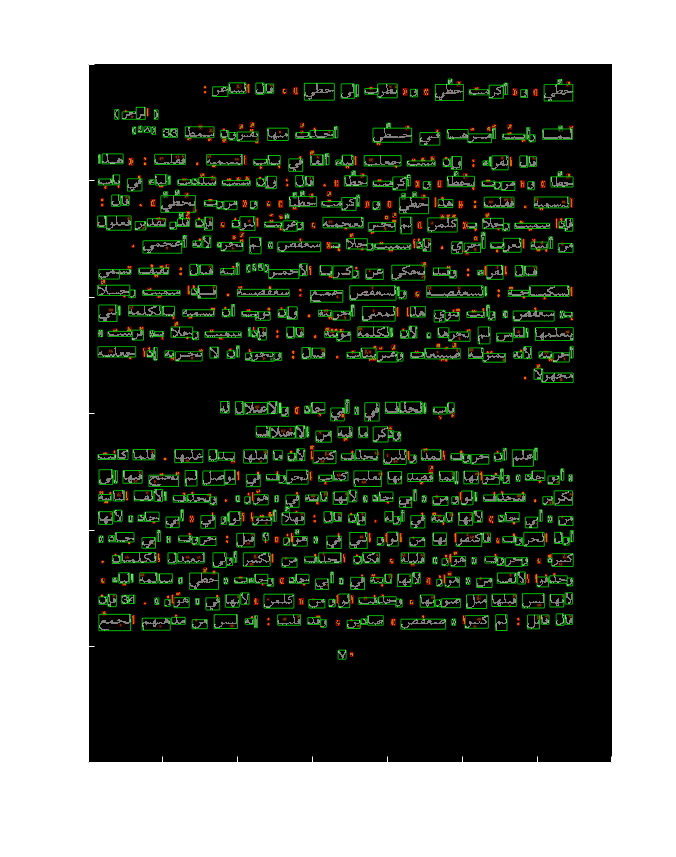
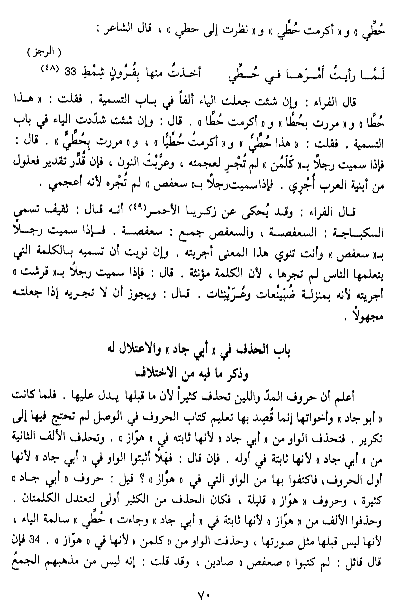

# Arabic page segmentation experiments

## Cursive
Arabic as a cursive language presents a number of challenges.  Most
OCR algorithms use the BW ("binarized") form of page image.  One can
break up the page into connected components (4-connected or
8-connected, for example).

## Characters, ligatures and connected components
This does not identify characters. A larger unit is ligature. However,
ligatures consist of component characters and the diacritical marks
belonging to the components. The diacritical marks are identified as
separate objects by image processing. Therefore, a good algorithm
(based on proper heuristic) is needed to assign diacritical marks to
the major parts of ligatures.

In this example we applied a simple heuristic, that characters
with sufficiently small filled area are diacritical marks.
This does not always work:

 * it picks up punctuation;
 * it picks up speckles (isolated groups of random pixels).

Further refinement of this idea can be implemented. It is not clear how
to automate the threshhold for the area of a diacritical mark.
One could perhaps examine curated ligatures and determine this number.

## Isolated, Initial, Medial and Final Forms
Connecting Arabic characters into ligatures happens by using 3 forms
of each basic character (see
.

## Lines of text
In this folder we also have an algorithm for breaking up text into
lines.  This algorithm fails if a page does not consist of purely
lines of text, but also includes images and oddly formatted text.

## Sample Result

The original Arabic text is:

