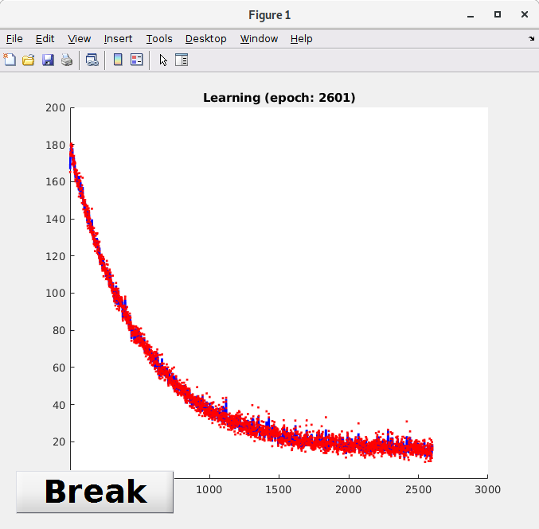

# Harvesting characters from a good quality printed book

The master strip is my_script.m

## Sample training

## Use of Tesseract

We used Tesseract to transcribe individual Chinese characters to
Unicode.  Wee demonstrated by training is that we can train a system
to **simulate Tesseract behavior** (errors and all).

## Research Problem
Classify characters using unsupervised learning