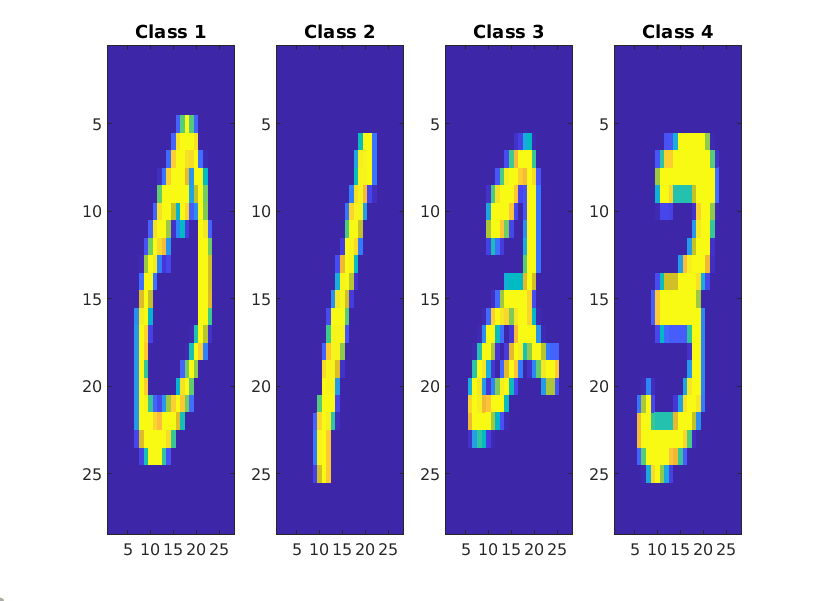
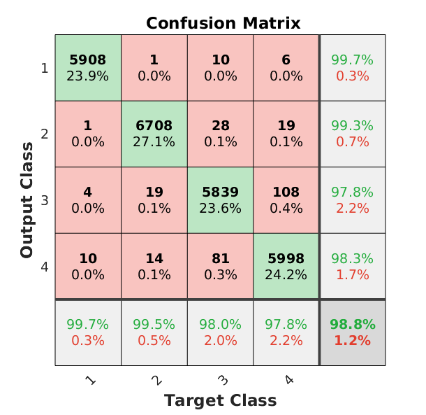

# Implementation of Logistic Regression for OCR

This folder contains a straightforward implementation of Logistic
Regression using MNIST data as the target content. The algorithm is
analyzed in the paper included in this repository.  The paper
[patternnet.pdf](patternnet.pdf) is of interest as it shows that under normal
circumstances the logistic regression algorithm does not require
regularization.

The results on digits

is the following confusion matrix:

