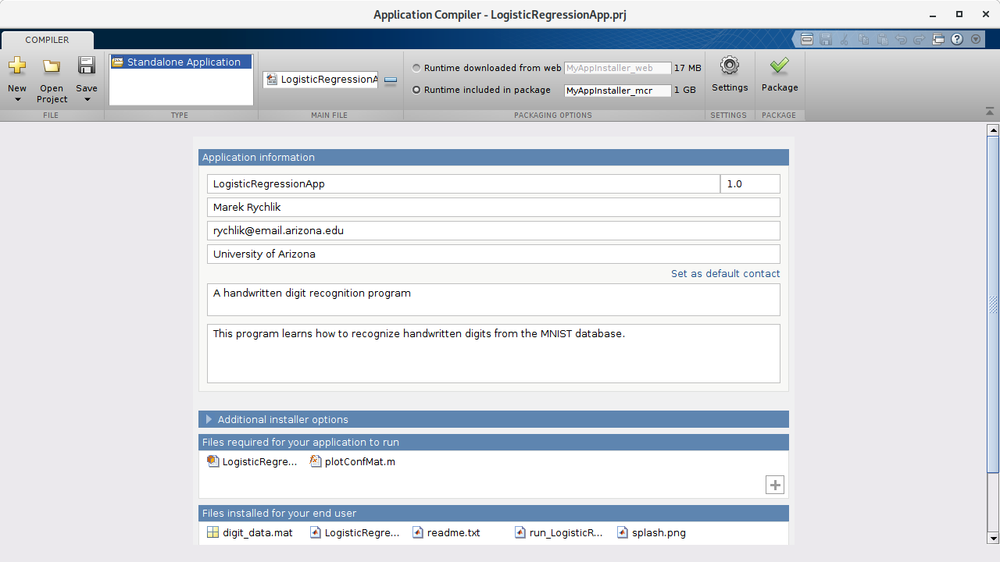
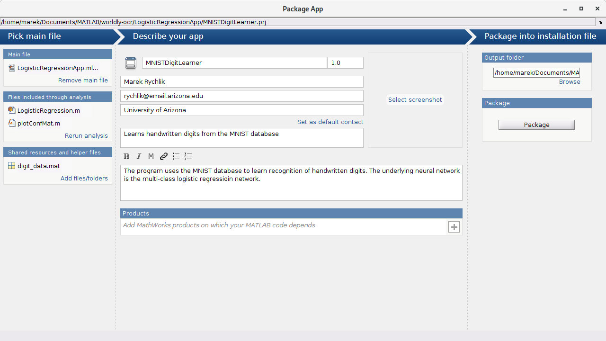
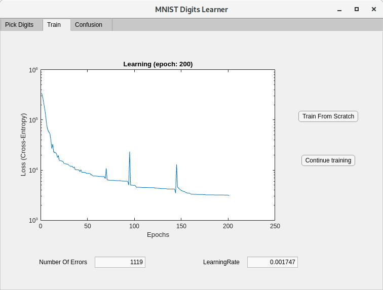
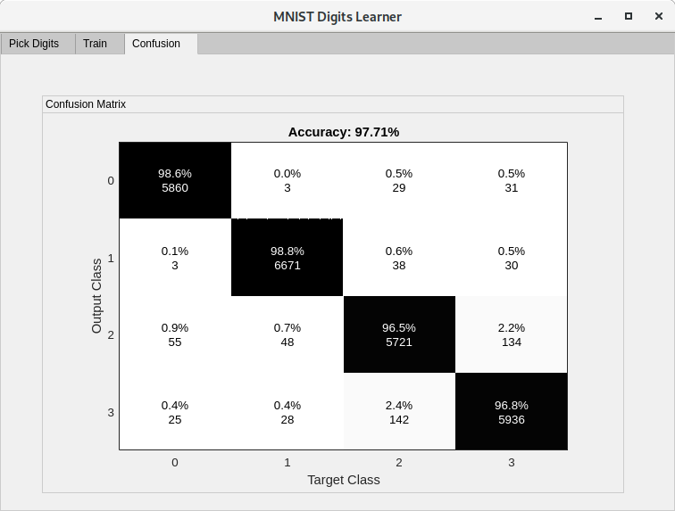
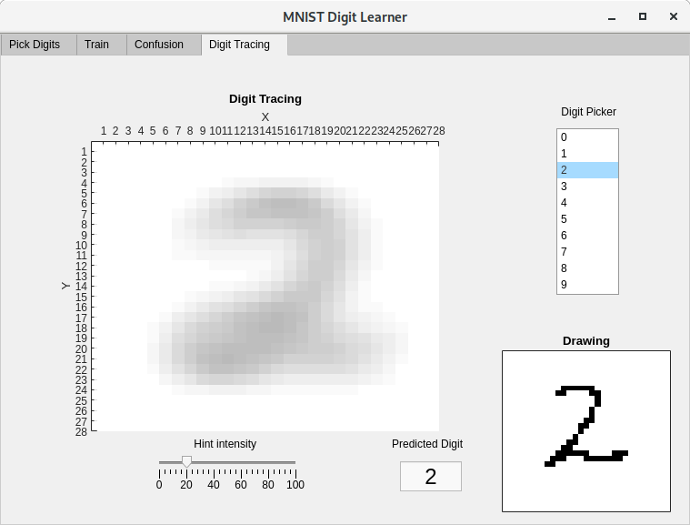

# MNIST Digits Learner
## A Demo Application in MATLAB
MATLAB has features for creating standalone applications. Applications generated by MATLAB:

- Do not require MATLAB to be installed
- Do not require MATLAB license
- Are cross-platform. Installers can be generated for Linux, Windows and Mac OS, and
other platforms.
- They can run as Web applications

The advantage of MATLAB is clear: the same codebase can be deployed
in various ways, which provides extreme flexibilixy.

## The scope of the demo application

The application in this folder is a GUI application for handwritten
digit recognition, and is a direct port to a GUI environment of the
implementation in the folder

[LogisticRegression](../LogisticRegression).

of the current project.

## The installer

Due to file size limitation of 100MB, we are not able to include the
installer on GitHub.  The installer is hosted on
[Bitbucket](http://bitbucket.org) and can be downloaded from here:

[MyAppInstaller_web.install](https://bitbucket.org/rychlikjobs/worldly-ocr-installer/src/master/LogisticRegressionApp/MyAppInstaller_web.install)

Currently we provide only a Linux installer (tested on Fedora 29, but
should work on most Linux platforms.)  It is an incomplete
installer. It comes without the MATLAB redistributable runtime, which
is currently a 2GB download. However, the installer will download the
necessary files as part of the installation process.

We also provide a .ctf file, which can be deployed to a MATLAB application server:
[LogisticRegressionApp.ctf](https://bitbucket.org/rychlikjobs/worldly-ocr-installer/src/master/LogisticRegressionApp/LogisticRegressionApp.ctf)

The way to set up a server is explained on the MathWorks website:
[Web Apps](https://www.mathworks.com/help/compiler/web-apps.html)

We note that the deployment amounts to copying the .ctf file to a designated folder
on the server.

## What if I have MATLAB and do not want to install a standalone app?
If you have MATLAB running, you can run the application within MATLAB.
In fact, the installation process is significantly simpler, as it is
not necessary to download and install the MATLAB runtime component from
MATLAB website.

You only need to download the file:

[MNISTDigitLearner.mlappinstall](./MNISTDigitLearner.mlappinstall)

Within matlab GUI, you do these steps:
- Go to the "APPS" tab
- Click on the icon "Install App"
- select the above downloaded file and install the app.

Upon completion, the application with a name "MNISTDigitLearner" can
be run by selecting it from the "APPS" dropdown menu.

You can also run the app programatically from a script by doing:

```Matlab
>> matlab.apputil.run('MNISTDigitLearner');
```
## Requirements:
### MATLAB App version (requires MATLAB)

Requirements for the MATLAB App version are:
- MATLAB version R2019a;
- Deep Learning Toolkit; the only dependency is the softmax function, which could be easily eliminated by one's own implementation.

### Standalone version

Requirements for the standalone version are:

- MATLAB runtime version 9 (based on release R2019a of MATLAB)

However, these dependencies should be resolved by the installer, by
downloading the most recent runtime from the
[Mathworks](http://mathworks.com) website. As previously indicated,
this **does not require MATLAB or MATLAB license**.

## How to create a standalone app installer?

These are the steps:

- Open the project file [LogisticRegressionApp.prj](./LogisticRegressionApp.prj) in MATLAB, by double clicking the project file in MATLAB file explorer window:

- Click on the "Package" button
- Optionally, exclude/include the MATLAB runtime by picking either "Runtime downloaded from the web"
 or "Runtime included in package"

If you include the runtime, it may need to be downloaded from the web
and the resulting installer will be about 2.2 GB. Else, the installer
will be about 300MB.

**NOTE:** Do not add the installer files to the GitHub repository, they are too large! Push them to the Bitbucket repository.

## How to create a MATLAB App suitable for installing in the "APPS" ribbon?

- Open the project file
  [MNISTDigitLearner.prj](./MNISTDigitLearner.prj) in MATLAB, by
  double clicking the project file in MATLAB file explorer window:

- Click on the "Package" button

**NOTE:** Do not add the installer files to the GitHub repository, they are too large! Push them to the Bitbucket repository.

## Application Screenshots






