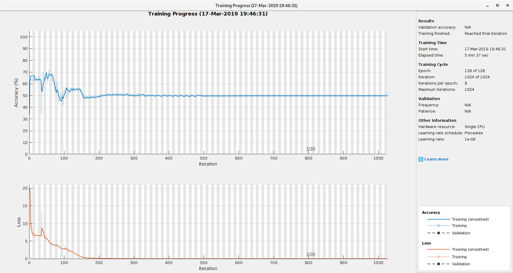

# W-lanbuage with LSTM and CTC

Connectionist Temporal Classification (CTC) has been invented by Alex Graves around 2006
for the purpose of training RNN on the label sequences that are shorter than the number of
time steps in a time series. That is, in the context of OCR, we do not need to precisely
determine the character boundaries. CTC will take care of dividing the sequence of
vertical sections into characters automatically.

In this folder there is a CTC experiment with W-language. The script [example2.m](./example2.m)
contains parameters to teach a bidirectional LSTM to recognize W-language constructs with 100%
accuracy. The non-strict W-language example allows random stretching of characters by a factor of
up to 2.

# A sample training session

## Note on accuracy graph

It is not real as in MATLAB accuracy is computed in a fashion which is
not consistent with the true accuracy of prediction (which is perfect, zero confusion!).

It should be noted that the decoding based on MATLAB classify function
is that of maximum likelihood path, not most probable label, which can
be found by Graves's prefix decoding algorithm (a version of
best-first search). According to Alex Graves, the most likely path
does not always belong to the most likely label, thus the need for
prefix search decoding.  However, we can see that the maximum
likelihood path decoding works pretty well on W-language.

TODO: Implement prefix search decoding.

# Resources

[A CTC article on distill.com](https://distill.pub/2017/ctc/)