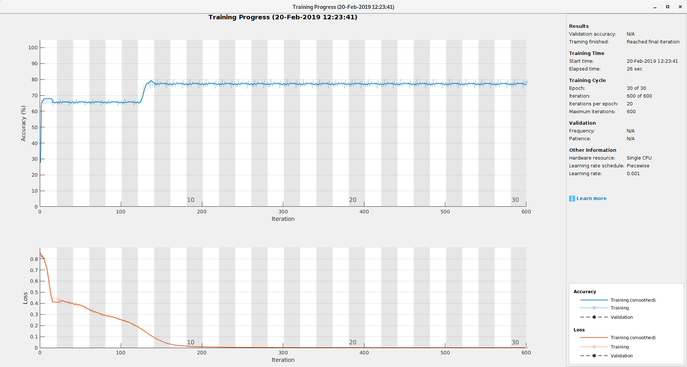

# W-Language with LSTM

W-language is an artificial language using only two characters (upper part of 'X' and 'O').
It is described in the paper:

[Deductron - A Recurrent Neural Network](https://arxiv.org/abs/1806.09038)

In this folder one finds MATLAB code to train a bidirectional LSTM on the W-language.
Like in the original paper, where a new kind of RNN called Deductron, we achieve
100% decoding accuracy for the strict W-language decoding (an experimental result).

# Entry point

The main script is WTrain.m.

# Sample training session

# TODO

* Use samples of different length in training and testing
* Explain why 'Accuracy' stays around 80% in training, while the
  'Loss' goes to 0. The confusion is 0, so the loss is indeed 0 in the
  limit. Requires looking into what MATLAB plots as 'Accuracy'.